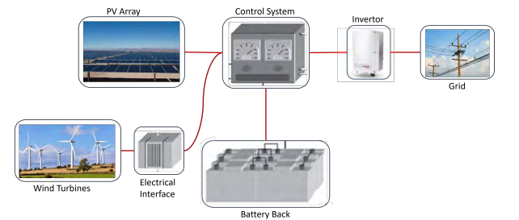
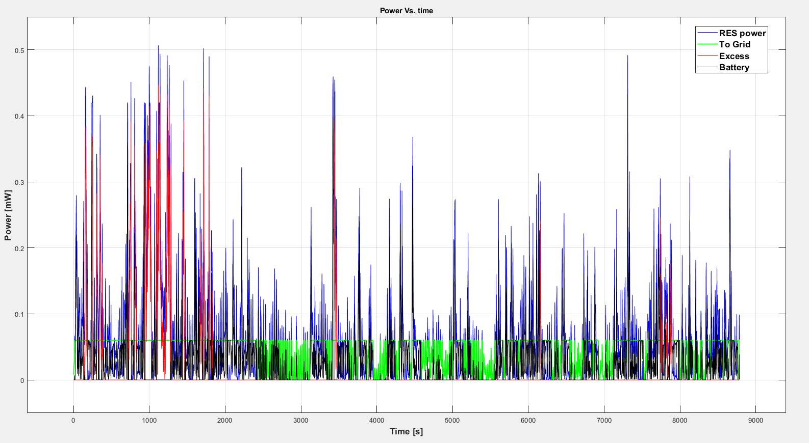

# Renewable Energy Power Plant Design

This project presents the design of a renewable energy power plant that integrates photovoltaic (PV) modules and wind turbines, collectively contributing to a maximum power output of 60 kW.

## Table of Contents
- [System Architecture](#proposed-system-architecture)
- [Usage](#usage)
- [Results](#obtained-results)

## Proposed System Architecture


## Usage
1. Clone this repository:
    ```bash
    git clone git@github.com:ahmed-yesuf/A-renewable-source-power-plant-design.git
    ```
2. Execute `main.m`. You can also modify the content of this file to try different settings such as different battery capacity, varying the number of PV modules and wind turbines, and using different meteorological data.

## Obtained Results
 
